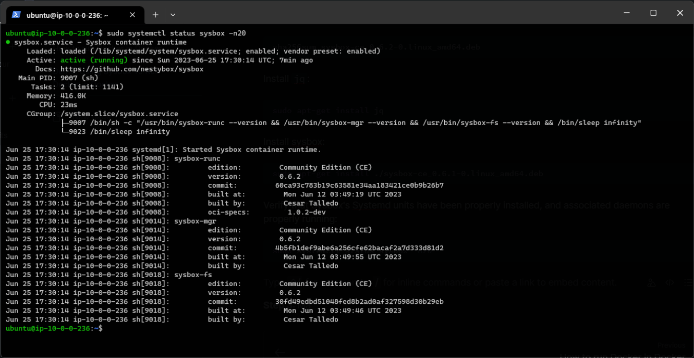
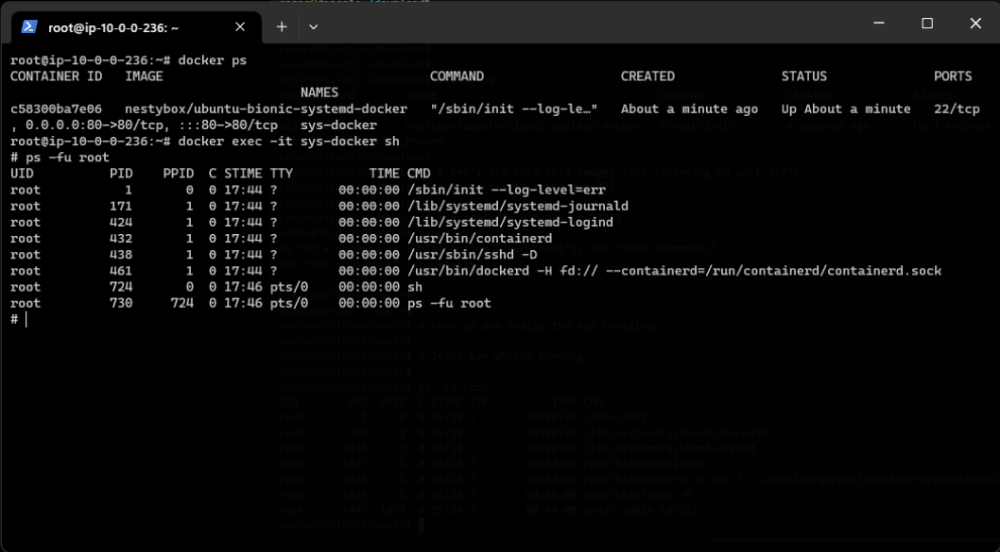
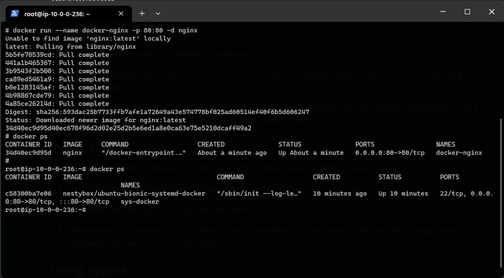

# How to run Docker in Docker

There are __three methods__ to run Docker in Docker containers:
1. __Docker in Docker Using DinD__: Grab the `docker:dind` tag on Docker Hub.
2. __Mounting the Hosts Docker Socket__: Run docker with the default Unix socket `docker.sock` as a volume.
3. __Using Sysbox To Run Docker in Docker__: [__Sysbox__](https://github.com/nestybox/sysbox) is an open-source dedicated container runtime that can nest containers without requiring privileged mode.

When running docker inside docker, be aware that the container will have more privileges over your docker daemon (docker run --privileged), which can pose security risks.

The biggest benefit to [__Sysbox__](https://github.com/nestybox/sysbox) approach,  is that it eliminates the security risks involved in running in privileged mode.

# Demo: Using Sysbox To Run Docker in Docker

## STEP 1: Make sure Docker is installed and running properly on your machine.

Visit [this instruction page](https://docs.docker.com/engine/install/ubuntu/) to see more details how to do it.

## STEP 2: Install Sysbox follow [the instructions](https://github.com/nestybox/sysbox/blob/master/docs/user-guide/install-package.md).

Get the package on the web:
```bash
wget https://downloads.nestybox.com/sysbox/releases/v0.6.2/sysbox-ce_0.6.2-0.linux_amd64.deb
```

Stop and remove all Docker containers:
```bash
sudo docker rm $(docker ps -a -q) -f
```

Verify that the checksum of the downloaded file fully matches the expected/published one:
```bash
sha256sum sysbox-ce_0.6.2-0.linux_amd64.debsudo docker rm $(docker ps -a -q) -f
```

Install `jq`:
```bash
sudo apt-get install jq
```

Install sysbox:
```bash
sudo apt-get install ./sysbox-ce_0.6.1-0.linux_amd64.deb
```

Verify that Sysbox's Systemd units have been properly installed, and associated daemons are properly running:
```bash
sudo systemctl status sysbox -n20
```


## STEP 3: Deploy the sys container (the outside container).

We will use a docker image with systemd + docker in it:
```bash
docker run --runtime=sysbox-runc --name sys-docker -p 80:80 -d nestybox/ubuntu-bionic-systemd-docker
```
Go into the sys docker and see what is running:


__systemd__ is init and it has started docker. It is quite like a VM.

## STEP 4: Deploy a container inside the sys container.



From the host machine we can only see the sys container but not the inside container.

=> The inside container is independent from the host machine.
